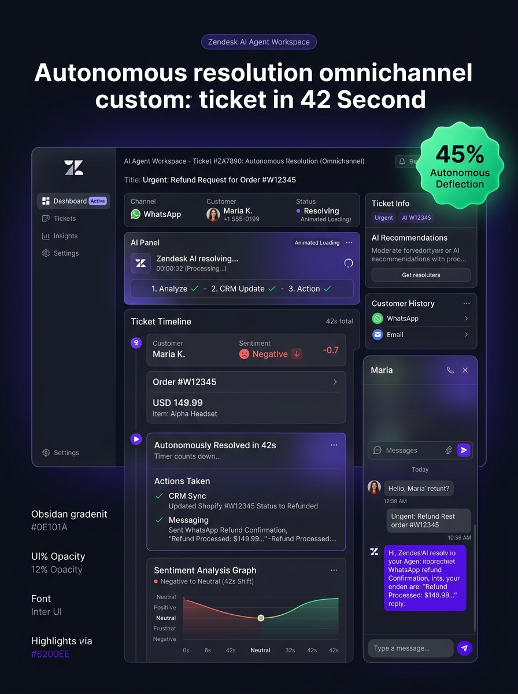
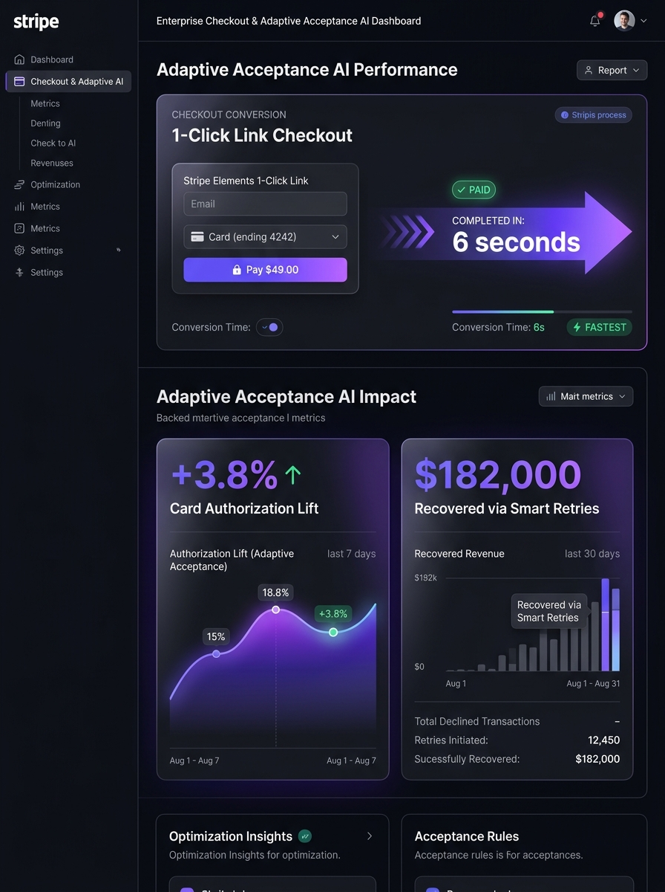
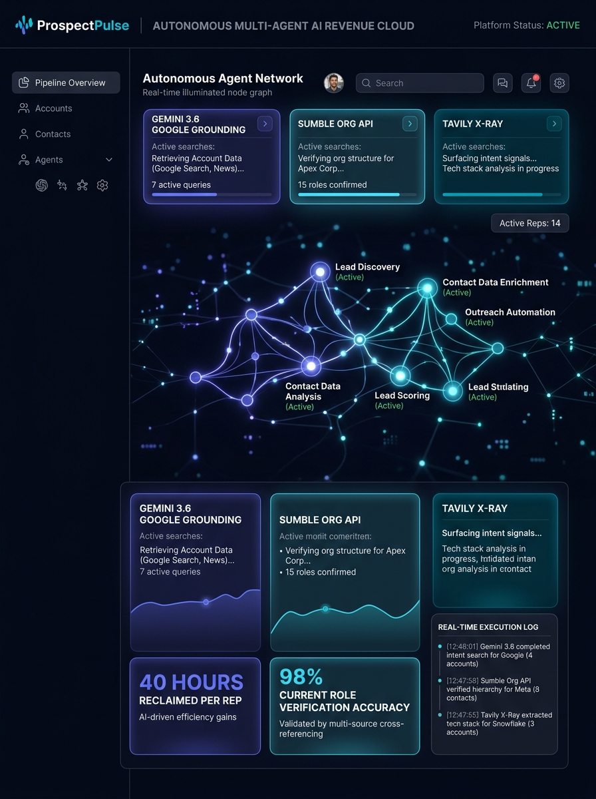

# ⚡ ProspectPulse AI
### *Autonomous Account Intelligence & Multi-Channel Outreach Studio*

Developed with precision by **[@ElChibo](https://github.com/ElChibo)**

[](https://www.python.org/)
[](https://aistudio.google.com/)
[](https://tavily.com/)
[](https://opensource.org/licenses/MIT)

---

## 🌟 Overview

**ProspectPulse AI** is an enterprise-grade, autonomous sales acceleration and multi-channel outreach engine. It connects real-time Model Context Protocol (MCP) agents, Google Gemini live search grounding, Sumble firmographics, and Tavily LinkedIn X-Ray targeting to eliminate 40+ minutes of manual pre-call research per account.

In under **5 seconds**, it produces:
1. **Verified Firmographics & Live Headcount** (via Sumble Org API).
2. **Real-Time News & Why-Now Triggers** (via Gemini 3.6 Google Search Grounding).
3. **Living Current Decision-Maker Mapping** (via strict LinkedIn X-Ray discovery, filtering out departed employees).
4. **Competitor Displacement Battlecards & Trap Questions** (covering SwagUp, 4imprint, Salesforce, Intercom Fin, Adyen, and Apollo).
5. **Dynamic Quantitative ROI & Economic Value Models**.
6. **Multi-Channel Sequences** (Day 0 Cold Email, 300-Char LinkedIn InMail, Cold Call Phone Scripts, and Photorealistic Product Proofs).
7. **Interactive AI Discovery Call & Objection Roleplay Sandbox**.
8. **Real-Time Voice Pitch & AI Voicemail Audio Player** (Native Web Speech Audio Engine).
9. **Print-Ready Executive Account Dossier PDF Export**.

---

## 📸 Demo Proofs & Visual Assets

| 🧦 Sock Club (Direct USA Mill Proof) | 🎧 Zendesk (AI Agent Workspace) |
| :---: | :---: |
|  |  |
| **💳 Stripe (1-Click Link & Auth Lift)** | **🤖 ProspectPulse (Multi-Agent Cloud)** |
|  |  |

---

## 🚀 Complete Feature Suite

### 1. 🎛️ Universal Multi-Organization Portability
Switch seamlessly between pre-built enterprise pitch presets:
* **🧦 Sock Club**: Pitching direct North Carolina mills, 75% combed cotton jacquard knits, 1-hour free digital proofs, and 95%+ wearable retention.
* **🎧 Zendesk**: Pitching rapid time-to-value, 45%+ autonomous ticket deflection, and native omnichannel support.
* **💳 Stripe**: Pitching +3.8% card authorization lift and 1-click Link checkout.
* **🤖 Enterprise AI SalesTech**: Pitching autonomous multi-source account intelligence.

### 2. 🎙️ Real-Time Voice Pitch & AI Voicemail Audio Player
* Listen to spoken cold call pitches and voicemails synthesized in real time.
* Features animated glowing audio waveforms and playback speed controls (`1.0x` to `1.3x`).

### 3. 📄 1-Click Executive Account Dossier PDF Export
* Generates a multi-page, print-ready PDF executive briefing complete with firmographics, verified contacts, displacement battlecards, quantitative ROI, and full outreach sequence.

### 4. 📊 Propensity-to-Buy & Timing Scorecard (0–100 Intent Gauge)
* Real-time radial intent score calculated from hiring velocity, incumbent displacement vulnerability, and event timing windows.

### 5. 🎨 Company Logo & Brand Palette Extractor
* Automatically extracts the target company's logo and official hex brand pantones with 1-click styling onto custom product proofs.

### 6. ✉️ 1-Click Direct Gmail Compose & LinkedIn Web Opener
* Launches Gmail compose in one click with To, Subject, and personalized body pre-filled.
* Navigates directly to the verified decision-maker's LinkedIn profile.

### 7. 🛡️ Live Deliverability & Spam Trigger Auditor
* Scans email drafts in real time for mobile read time, reading grade levels, and risky spam trigger words (*"guarantee"*, *"100%"*, *"act now"*).
* Includes a 1-click **"⚡ Auto-Clean Flags"** button to replace spam triggers with consultative executive phrasing.

### 8. 🎭 AI Discovery Call & Objection Simulator
* Interactive practice arena where you pitch against skeptical VP of Marketing, overworked HR, or analytical CFO personas with real-time AI coach feedback.

### 9. 📊 2026 Competitor Comparison Landscape Matrix
* Multi-column side-by-side comparison tables against SwagUp, 4imprint, Salesforce, Intercom, and legacy databases.

### 10. 📹 45-Second Video Pitch Teleprompter Mode
* Auto-scrolling teleprompter with reading timer and speed controls for recording high-converting async video pitches (Loom / Vidyard).

### 11. 💡 5-Whys Executive Discovery Diagnostic Generator
* Uncovers latent prospect pain in the first 3 minutes of a discovery call with 5 tailored questions.

### 12. 💰 Deal Size & ARR Pipeline Value Estimator
* Computes initial order value, annualized ARR, and expected sales commission in real time.

### 13. 📂 Bulk CSV & Multi-Domain Territory Importer
* Paste 5–10 domains or upload a `.csv` file to run automated territory research in batch.

### 14. 📱 Live Mobile iPhone Lock Screen & Notification Simulator
* Live iPhone frame rendering real-time push notifications and scrollable mobile mail views with exact character truncation modeling.

### 15. 🎯 AI Open Probability & Subject Line Heatmap
* Real-time subject scoring analyzing open likelihood %, mobile cutoff thresholds, and emotional curiosity resonance.

### 16. 🔮 Predictive Objection Forecaster
* Forecasts the top 3 specific objections this account will raise before you dial, with 1-click counter-arguments.

### 17. 🏢 Enterprise Multi-Unit Account Hierarchy Tree
* Visualizes parent organizations, regional hubs, and targeted buying centers for global multi-threading.

### 18. 🌓 Obsidian Dark / High-Contrast Theme Toggle
* One-click theme switcher optimized for daylight demos, client screen-shares, and conference projectors.

---

## 🛠️ Architecture & Data Pipeline

```
┌──────────────────┐    ┌──────────────────┐    ┌──────────────────┐
│  Google Gemini   │    │    Sumble Org    │    │    Tavily AI     │
│    3.6 Flash     │    │      v9 API      │    │  LinkedIn X-Ray  │
│ (Search Ground)  │    │  (Org Headcount) │    │ (Current Roles)  │
└────────┬─────────┘    └────────┬─────────┘    └────────┬─────────┘
         │                       │                       │
         └───────────────────────┼───────────────────────┘
                                 ▼
               ┌───────────────────────────────────┐
               │    ProspectPulse Engine (Python)  │
               │   • Strict Role Verification      │
               │   • Competitor Displacement Logic │
               │   • Dynamic ROI Math Engine       │
               └─────────────────┬─────────────────┘
                                 ▼
               ┌───────────────────────────────────┐
               │      Obsidian Dark UI Console     │
               │   • Multi-Channel Outreach Studio │
               │   • Photorealistic Proof Canvas   │
               │   • Voice Synthesizer & PDF Briefs│
               └───────────────────────────────────┘
```

---

## 💻 Quickstart & Setup

### Prerequisites
* Python 3.10 or higher
* Google Gemini API Key ([Get Key](https://aistudio.google.com/))
* Tavily AI API Key ([Get Key](https://tavily.com/))
* Sumble API Key ([Get Key](https://sumble.com/))

### 1. Clone the Repository
```bash
git clone https://github.com/ElChiboZD/ProspectPulse-AI---Autonomous-Account-Intelligence-Multi-Channel-Outreach-Studio-.git
cd ProspectPulse-AI---Autonomous-Account-Intelligence-Multi-Channel-Outreach-Studio-
```

### 2. Install Dependencies
```bash
pip install -r requirements.txt
```

### 3. Configure Environment Variables
Copy `.env.example` to `.env` and insert your API credentials:
```bash
cp .env.example .env
```

Edit `.env`:
```env
GEMINI_API_KEY=your_gemini_api_key
TAVILY_API_KEY=your_tavily_api_key
SUMBLE_API_KEY=your_sumble_api_key
PORT=8765
```

### 4. Launch the Server
```bash
python server.py
```

### 5. Open in Browser
Visit **`http://127.0.0.1:8765`** in your browser.

---

## 📜 Project Structure

```
ProspectPulse-AI/
├── .env.example               # Environment variable template
├── .gitignore                  # Git ignore rules (protects API keys)
├── README.md                   # Project documentation & architecture
├── server.py                   # Python HTTP backend & MCP agent pipeline
├── push_to_github.py           # GitHub sync utility
├── static/
│   ├── index.html              # Obsidian Dark UI console & outreach studio
│   └── proofs/                 # Photorealistic Gemini AI demo proofs
│       ├── lululemon.jpg
│       ├── saas.jpg
│       ├── sockclub.jpg
│       ├── stripe.jpg
│       ├── vitacoco.jpg
│       └── zendesk.jpg
└── prompts/                    # System prompt templates
```

---

## 👤 Author & Attribution

Engineered with passion by **[@ElChibo](https://github.com/ElChibo)**.  
For questions or enterprise custom deployments, open an issue or pull request!

---
*License: MIT*
